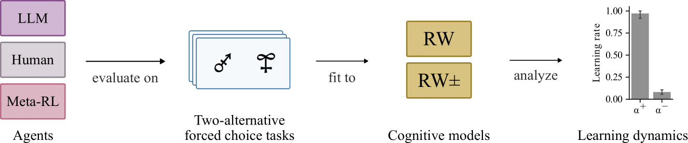

# In-Context Learning Agents Are Asymmetric Belief Updaters

## Abstract

We study the in-context learning dynamics of large language models (LLMs) using three instrumental learning tasks adapted from cognitive psychology. We find that LLMs update their beliefs in an asymmetric manner and learn more from better-than-expected outcomes than from worse-than-expected ones. Furthermore, we show that this effect reverses when learning about counterfactual feedback and disappears when no agency is implied. We corroborate these findings by investigating idealized in-context learning agents derived through meta-reinforcement learning, where we observe similar patterns. Taken together, our results contribute to our understanding of how in-context learning works by highlighting that the framing of a problem significantly influences how learning occurs, a phenomenon also observed in human cognition.

## Code

Schematic of our methodology, where we evaluate the learning dynamics of LLMs (`llm`), humans (`human`), and meta-reinforcement learning agents (`meta-rl`) on two-alternative forced choice tasks (partial feedback task (`partial`), full feedback task (`full`), agency task (`agency`)). After evaluating the agents on the tasks, we fit variants of cognitive models based on the Rescorla-Wagner (RW) model to the resulting behavior. Finally, we analyze the fitted models and extract and compare the learning rates.

All steps were conducted on a Slurm-based cluster with a multiple CPUs in Python using PyTorch. 
Additional analyses were carried out using NumPy, Pandas, and SciPy. Jupyter Notebooks, Matplotlib and Seaborn were used for data analysis and plotting.

### 1. Generating behavioral data

#### Human

Human data was retrieved for the partial feedback task from [Lefebvre 2017](https://figshare.com/articles/dataset/Behavioral_data_and_data_extraction_code/4265408/1) and for the full feedback and the agency task from [Chambon 2020](https://github.com/spalminteri/agency.git). The data was converted into a format suitable for the cognitive model fitting.

**References**

Chambon, V., Théro, H., Vidal, M., Vandendriessche, H., Haggard, P., & Palminteri, S. (2020). Information about action outcomes differentially affects learning from self-determined versus imposed choices. Nature Human Behaviour, 4(10), Article 10. https://doi.org/10.1038/s41562-020-0919-5

Lefebvre, G., Lebreton, M., Meyniel, F., Bourgeois-Gironde, S., & Palminteri, S. (2017). Behavioural and neural characterization of optimistic reinforcement learning. Nature Human Behaviour, 1(4), 0067. https://doi.org/10.1038/s41562-017-0067

#### LLM

For the LLM tests, we implemented an interface to HuggingFace, OpenAI and Anthropic models. You need API access to either HuggingFace, Anthropic or OpenAI. If you have it, place your API-Key in an `llm/.env` with `COMPANY_API_KEY=[INSERT]`
The `llm` folder contains subfolders for each task. In these folders the `query.py` file can be executed to simulate the model runs for each task. 

Robustness checks were performed on the partial task with additional LLMs. Furthermore a modified version of this task with more than two bandits was used and is located in the folder `partial_addition`.

#### Meta-RL

The `meta-rl` folder contains subfolders for each task. To train the agent, use `train.py`, to test on the actual experimental task use `test.py` in the `task` folder.

### 2. Fitting of cognitive models 

To fit the cognitive models for all agent, use the `fitting.py` procedure in the folder `cognitive_models`. The cognitive models are defined in the `cognitive_models.py`script in the same folder. 

### 3. Analysis

Figures and statistical analysis can be reproduced with `plots.py` and `significance_test.py` respectively in the `analysis` folder.